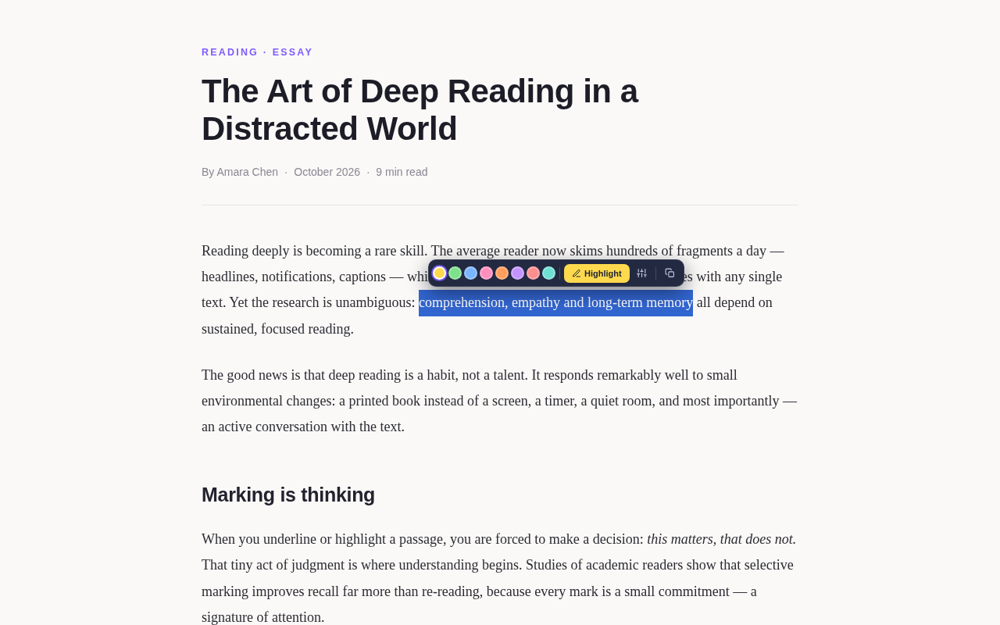
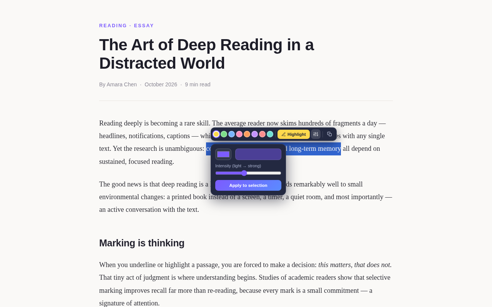
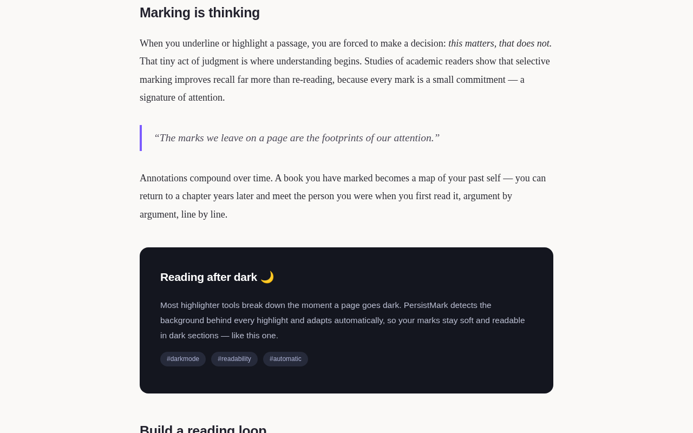
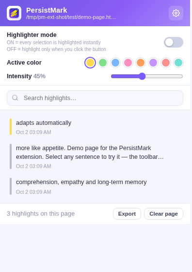
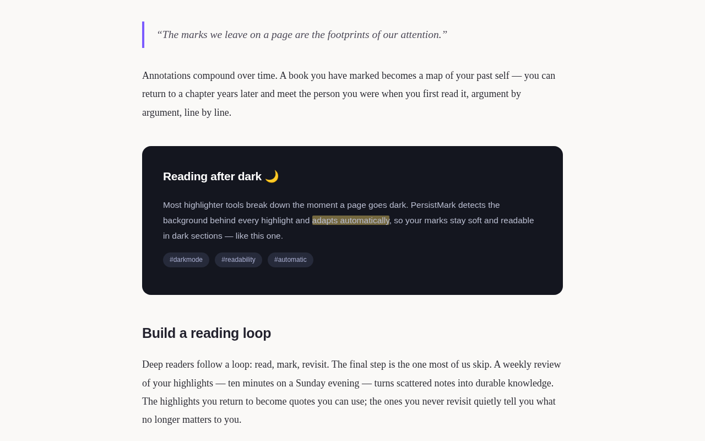
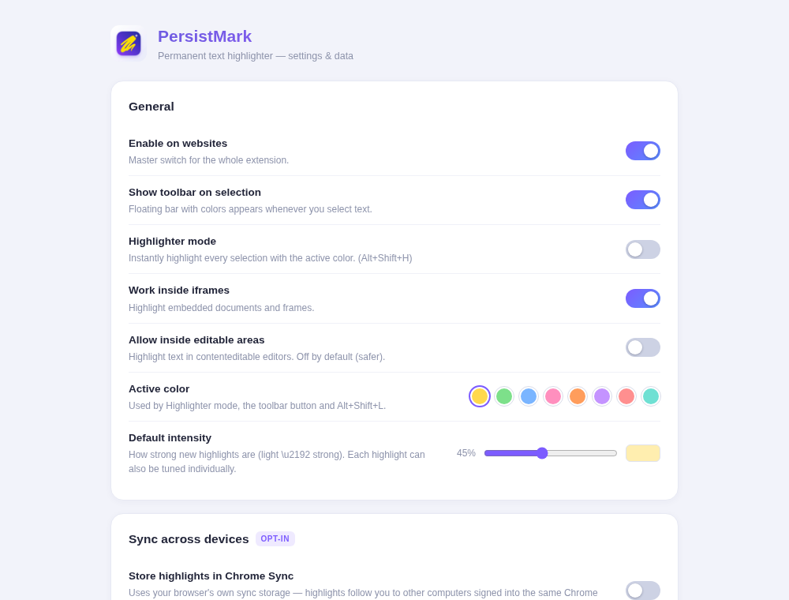

<div align="center">


# PersistMark

**Highlight any text on any website — and keep it forever.**

Refresh the page, close the browser, restart your computer — your highlights
will be exactly where you left them.

[](LICENSE)
[](https://developer.chrome.com/docs/extensions/develop/migrate)
[](https://github.com/your-username/persistmark-extension/actions/workflows/ci.yml)
[](CONTRIBUTING.md)

[Installation](#-installation) · [Usage](#-usage) · [How it works](docs/architecture.md) · [Privacy](PRIVACY_POLICY.md) · [Contributing](CONTRIBUTING.md)

</div>

---

## The problem

You highlight something in your browser with your mouse — then you click
elsewhere, refresh the page, or come back tomorrow, and **the highlight is gone**.
Browser selections are ephemeral by design.

PersistMark turns any selection into a **persistent highlight**: it stores a smart
anchor for the text (not pixels, not DOM nodes) and re-applies it every time you
return to that page — on any website where text can be selected.

## ✨ Features

| | Feature |
|---|---|
| 🎨 | **8 preset colors + any custom color** — pick from the palette or choose an exact shade |
| 💧 | **Intensity control** — make every highlight lighter or stronger, per highlight or globally |
| 🪄 | **Selection toolbar** — appears instantly above any selection (drag, double-click, triple-click or keyboard) and stays until you act |
| 🔒 | **Persistent highlights** — survive refresh, restarts and revisits |
| 🧠 | **Smart text anchoring** — context + occurrence matching relocates highlights even when the layout changes |
| 🗑️ | **4 ways to delete** — popover Delete · toolbar trash · right-click menu · `Alt+Shift+D` |
| ↩️ | **Undo toast** — deleted by mistake? One click restores it within 6 seconds |
| 🌙 | **Dark & light mode aware** — each highlight adapts to the page background automatically |
| 🧠 | **Last-color memory** — the Highlight button always uses your most recent color |
| ⚡ | **Optional highlighter mode** — auto-highlight every selection (`Alt+Shift+H`), off by default |
| 📋 | **Highlight manager** — searchable list, notes, copy, jump-to-highlight, badge count |
| 🖱️ | **Context menu** — right-click any selection to highlight it |
| 🔄 | **Works on modern web apps** — SPAs (YouTube, Reddit…), lazy-loaded content and iframes |
| 💾 | **Backups** — export/import all highlights as JSON; optional Chrome Sync across devices |
| 🚫 | **Site blocklist** — disable the extension on specific domains |
| 🔐 | **100% private** — no accounts, no analytics, no network requests; everything stays in your browser |

## 📸 Screenshots

<table>
  <tr>
    <td></td>
    <td></td>
  </tr>
  <tr>
    <td></td>
    <td></td>
  </tr>
  <tr>
    <td></td>
    <td></td>
  </tr>
</table>

## 📥 Installation

### From source (Developer mode) — Chrome, Edge, Brave

1. Download or clone this repository.
2. Open `chrome://extensions` (Edge: `edge://extensions`, Brave: `brave://extensions`).
3. Enable **Developer mode** (top-right).
4. Click **Load unpacked** and select the repository folder.
5. Pin 🖍️ PersistMark to your toolbar. Done.

> **Local files:** to highlight text on `file://` pages, enable
> *Details → Allow access to file URLs* for PersistMark.

### Firefox

Firefox is not officially packaged yet, but the extension is nearly compatible —
see [docs/installation.md](docs/installation.md#firefox) for the 3 small changes.

## 🚀 Usage

1. **Select text** anywhere — the floating toolbar appears instantly. Nothing is
   highlighted until you confirm.
2. **Click Highlight** to use your last color, or click any of the 8 dots to
   highlight in that color (it also becomes your new default).
3. That's it. Come back tomorrow — your highlights are still there.

<details>
<summary><b>Custom colors & intensity</b></summary>

1. Select text and click the **sliders** button on the toolbar.
2. Pick any color and drag the **Intensity** slider (live preview included).
3. Click **Apply to selection**.

To adjust an existing highlight, click it and use the intensity slider or color
dots in the popover — changes apply and save instantly.
</details>

<details>
<summary><b>Deleting highlights</b></summary>

| Method | Action |
|---|---|
| Popover | Click a highlighted text → **Delete** |
| Toolbar | Select highlighted text → 🗑️ |
| Context menu | Right-click a selection → **Remove highlights in selection** |
| Keyboard | Select text → `Alt+Shift+D` |

A 6-second **Undo** toast appears after every deletion.
</details>

**Keyboard shortcuts**

| Shortcut | Action |
|---|---|
| `Alt+Shift+H` | Toggle highlighter mode (auto-highlight every selection) |
| `Alt+Shift+L` | Highlight the current selection with your active color |
| `Alt+Shift+D` | Remove highlights inside the current selection |

## 🧠 How it works

Instead of remembering pixels or DOM paths, PersistMark stores a **text anchor**
for every highlight:

- the selected text itself,
- ~40 characters of context before and after it,
- which occurrence of that context pattern it was,
- and an XPath fallback as a last resort.

On every page load the extension builds a normalized text index of the document
and relocates each anchor, so highlights survive layout changes, dynamic content
and single-page-app navigation. Full details in
[docs/architecture.md](docs/architecture.md).

## 🔐 Privacy

PersistMark collects nothing. There are no accounts, no analytics and no network
requests. All data stays in `chrome.storage` on your machine — the optional sync
feature only uses your browser's own Chrome Sync storage. Read the full
[Privacy Policy](PRIVACY_POLICY.md).

## 🧪 Development & testing

```bash
git clone https://github.com/your-username/persistmark-extension.git
cd persistmark-extension
npm install          # installs jsdom (dev dependency)

npm run test:engine  # 30 checks — anchoring engine (jsdom)
npm run test:e2e     # 39 checks — full UI in real Chromium (Playwright)
npm run lint         # syntax + manifest validation
```

See [CONTRIBUTING.md](CONTRIBUTING.md) for the contribution guide.

## ❓ FAQ

<details>
<summary><b>Why doesn't it work on Google Docs?</b></summary>

Google Docs (and other canvas-based apps) draw text onto a `<canvas>` instead of
putting it in the DOM. There is no real text to anchor to, so highlighting is not
technically possible there.
</details>

<details>
<summary><b>A highlight didn't come back after the page changed.</b></summary>

If the page's text itself changed (edited, removed, or served differently),
the anchor no longer matches. PersistMark retries with context, then occurrence,
then XPath — but if the text is gone, the highlight can't be re-applied.
</details>

<details>
<summary><b>Where is my data stored?</b></summary>

In your browser's local extension storage (`chrome.storage.local`). Optionally in
`chrome.storage.sync` if you enable sync, which shares highlights across devices
signed into the same Chrome profile.
</details>

<details>
<summary><b>Can I back up my highlights?</b></summary>

Yes — the popup's **Export** button downloads a JSON backup; **Import** (in the
options page) restores it by merging or replacing.
</details>

## 🤝 Contributing

Bug reports, feature ideas and pull requests are welcome! Please read
[CONTRIBUTING.md](CONTRIBUTING.md) first. For security issues see
[SECURITY.md](SECURITY.md).

## 📄 License

Copyright © 2026 **MD Mamun**. Released under the
[GNU General Public License v3](LICENSE).

---

<p align="center">Made with ❤️ and shipped fully local & private.</p>
